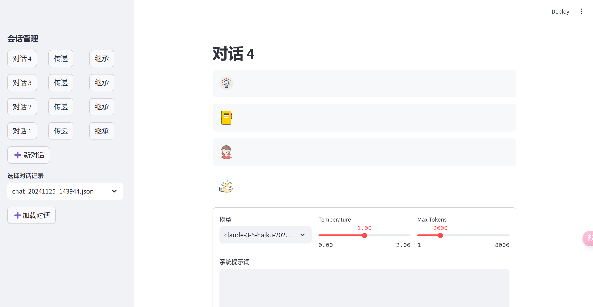
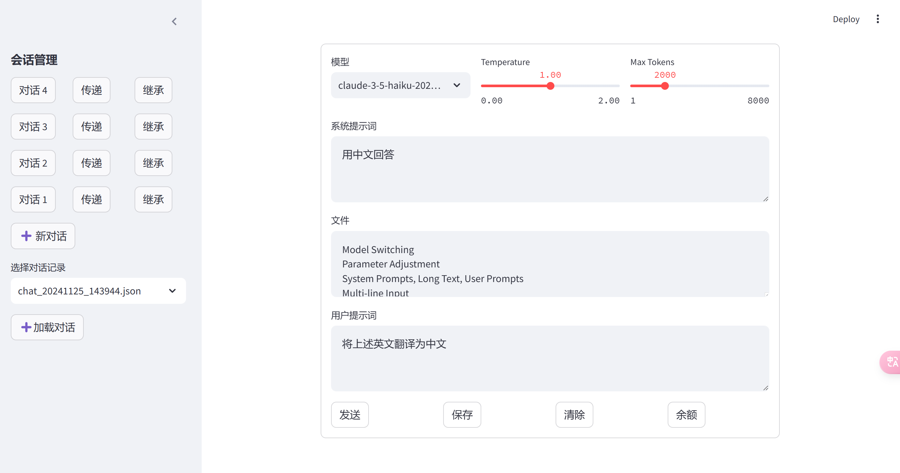

# Claude_Streamlit_ChatBot

> 使用 Streamlit 聊天消息模板的 Claude 聊天机器人。多个独立对话组之间的信息传递：组 A 的最后一个回复成为组 B 的文本输入。对话组继承：将组 A 的系统提示、长文本和用户提示作为组 B 的预设。基于chat_message函数修改，提供更丰富的体验：

- 模型切换
- 参数调控
- 系统提示词、长文本、用户提示词
- 多行输入
- 流式输出、markdown渲染、支持代码一键复制
- 发送、保存对话、清除对话
- 多个对话组独立
- 输入/N 名称 - 创建新对话
- 输入/RN 新名称 - 重命名当前对话
- 输入/DEL - 删除当前对话
- 对话组间信息传递：A的最后一个回答，作为B的文本输入
- 对话组的继承：保留A对话组的系统提示词、长文本、用户提示词，作为B对话的预设
- 加载聊天记录

